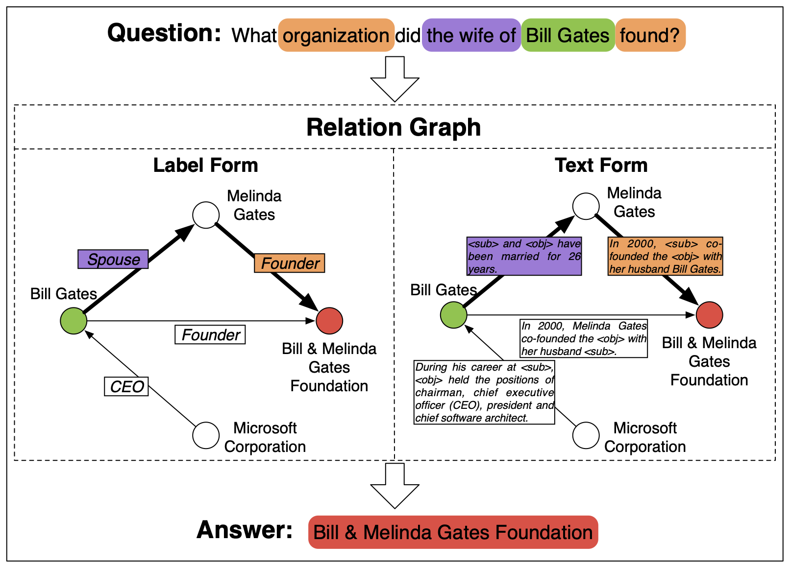

# TransferNet

Pytorch implementation of EMNLP 2021 paper 

**[TransferNet: An Effective and Transparent Framework for Multi-hop Question Answering over Relation Graph](https://arxiv.org/abs/2104.07302)**
<br>
[Jiaxin Shi](https://shijx12.github.io), Shulin Cao, Lei Hou, [Juanzi Li](http://keg.cs.tsinghua.edu.cn/persons/ljz/), [Hanwang Zhang](http://www.ntu.edu.sg/home/hanwangzhang/#aboutme)

We perform transparent multi-hop reasoning over relation graphs of label form (i.e., knowledge graph) and text form. This is an example:

<div align="center">
    
</div><br/>

If you find this code useful in your research, please cite
``` tex
@inproceedings{shi2021transfernet,
  title={TransferNet: An Effective and Transparent Framework for Multi-hop Question Answering over Relation Graph},
  author={Jiaxin Shi, Shulin Cao, Lei Hou, Juanzi Li, Hanwang Zhang},
  booktitle={EMNLP},
  year={2021}
}
```

## dependencies
- pytorch>=1.2.0
- [transformers](https://github.com/huggingface/transformers)
- tqdm
- nltk
- shutil

## Prepare Datasets
- [MetaQA](https://goo.gl/f3AmcY), we only use its vanilla version.
- [MovieQA](http://www.thespermwhale.com/jaseweston/babi/movieqa.tar.gz), we need its `knowledge_source/wiki.txt` as the text corpus for our MetaQA-Text experiments. Copy the file into the folder of MetaQA, and put it together with `kb.txt`. The files of MetaQA should be something like
```shell
MetaQA
+-- kb
|   +-- kb.txt
|   +-- wiki.txt
+-- 1-hop
|   +-- vanilla
|   |   +-- qa_train.txt
|   |   +-- qa_dev.txt
|   |   +-- qa_test.txt
+-- 2-hop
+-- 3-hop
```
- [WebQSP](https://drive.google.com/drive/folders/1RlqGBMo45lTmWz9MUPTq-0KcjSd3ujxc?usp=sharing), which has been processed by [EmbedKGQA](https://github.com/malllabiisc/EmbedKGQA).
- [ComplexWebQuestions](https://drive.google.com/file/d/1ua7h88kJ6dECih6uumLeOIV9a3QNdP-g/view?usp=sharing), which has been processed by [NSM](https://github.com/RichardHGL/WSDM2021_NSM).
- [GloVe 300d pretrained vector](http://nlp.stanford.edu/data/glove.840B.300d.zip), which is used in the BiGRU model. After unzipping it, you need to convert the txt file to pickle file by 
``` shell
python pickle_glove.py --txt </path/to/840B.300d.txt> --pt </output/file/name>
```


## Experiments

### MetaQA-KB

1. Preprocess
```shell
python -m MetaQA-KB.preprocess --input_dir <PATH/TO/METAQA> --output_dir <PATH/TO/PROCESSED/FILES>
```

2. Train
```shell
python -m MetaQA-KB.train --glove_pt <PATH/TO/GLOVE/PICKLE> --input_dir <PATH/TO/PROCESSED/FILES> --save_dir <PATH/TO/CHECKPOINT>
```

3. Predict on the test set
```shell
python -m MetaQA-KB.predict --input_dir <PATH/TO/PROCESSED/FILES> --ckpt <PATH/TO/CHECKPOINT> --mode test
```

4. Visualize the reasoning process. It will enter an IPython environment after showing the information of each sample. You can print more variables that you are insterested in. To stop the process, you need to quit the IPython by `Ctrl+D` and then kill the loop by `Ctrl+C` immediately.
```shell
python -m MetaQA-KB.predict --input_dir <PATH/TO/PROCESSED/FILES> --ckpt <PATH/TO/CHECKPOINT> --mode vis
```

### MetaQA-Text

1. Preprocess
```shell
python -m MetaQA-Text.preprocess --input_dir <PATH/TO/METAQA> --output_dir <PATH/TO/PROCESSED/FILES>
```

2. Train
```shell
python -m MetaQA-Text.train --glove_pt <PATH/TO/GLOVE/PICKLE> --input_dir <PATH/TO/PROCESSED/FILES> --save_dir <PATH/TO/CHECKPOINT>
```

The scripts for inference and visualization are the same as **MetaQA-KB**. Just change the python module to `MetaQA-Text.predict`.


### MetaQA-Text + 50% KB

1. Preprocess
```shell
python -m MetaQA-Text.preprocess --input_dir <PATH/TO/METAQA> --output_dir <PATH/TO/PROCESSED/FILES> --kb_ratio 0.5
```

2. Train, it needs more active paths than MetaQA-Text
```shell
python -m MetaQA-Text.train --input_dir <PATH/TO/PROCESSED/FILES> --save_dir <PATH/TO/CHECKPOINT> --max_active 800 --batch_size 32
```

The scripts for inference and visualization are the same as **MetaQA-Text**.


### WebQSP
WebQSP does not need preprocess. We can directly start the training:

```shell
python -m WebQSP.train --input_dir <PATH/TO/UNZIPPED/DATA> --save_dir <PATH/TO/CHECKPOINT>
```


### ComplexWebQuestions
Similar to WebQSP, CWQ does not need preprocess. We can directly start the training:

```shell
python -m CompWebQ.train --input_dir <PATH/TO/UNZIPPED/DATA> --save_dir <PATH/TO/CHECKPOINT>
```
